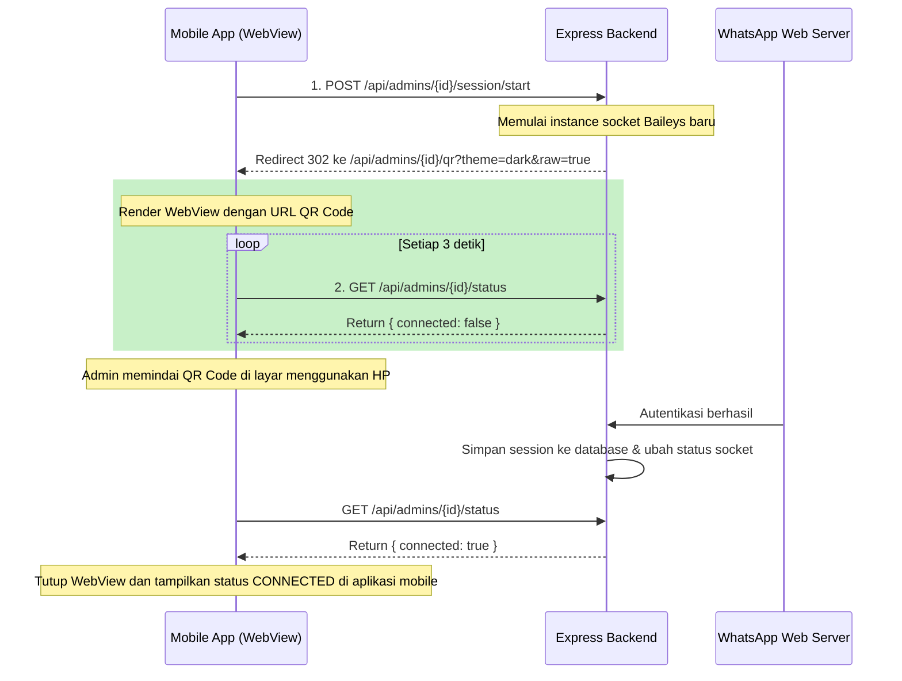

# TripBwi CRM — REST API Documentation
> Panduan integrasi REST API untuk Mobile App Developer (Flutter, React Native, Swift, Kotlin, dsb.)

---

## 📌 Informasi Umum

| | |
|---|---|
| **Base URL** | `http://localhost:3000/api` (atau domain server production) |
| **Format** | JSON (`Content-Type: application/json`) |
| **Autentikasi** | Bearer Token (JWT, masa berlaku 24 jam) |
| **Token Source** | Didapat dari response body endpoint `POST /auth/login` |

---

## 🔒 Autentikasi & Header

Semua endpoint dilindungi oleh `authMiddleware` kecuali endpoint Login. Developer wajib menyisipkan token ke header HTTP:

```http
Authorization: Bearer <JWT_TOKEN_DISINI>
```

> **Tips Mobile:** Simpan JWT token ini di secure storage perangkat (seperti `flutter_secure_storage` untuk Flutter, `react-native-keychain` untuk React Native, atau SecurePreferences di Android). Jangan menyimpannya di plaintext shared preferences.

---

## 🚦 Rate Limiting & Error Code

Untuk menjaga performa server, dipasang rate limiter per IP address:

* **Endpoint Login (`POST /auth/login`):** Maksimal 20 request per 15 menit.
* **Endpoint Lainnya:** Maksimal 500 request per 15 menit.

Jika limit terlampaui, server mengembalikan status code `429 Too Many Requests` dengan body:
```json
{
  "success": false,
  "error": "Too many requests from this IP, please try again after 15 minutes."
}
```

---

## 📁 Model Data Penting

### 1. Format Response Sukses
```json
{
  "success": true,
  "data": { ... } // data objek atau array
}
```

### 2. Format Response Gagal (Error)
```json
{
  "success": false,
  "error": "Pesan error yang deskriptif"
}
```

---

## 🔐 Endpoints: Autentikasi

### 1. Login Admin
Mengautentikasi admin dan mengambil token. Endpoint ini tidak memerlukan token header.
* **URL:** `POST /auth/login`
* **Request Body:**
  ```json
  {
    "username": "sari_cs",
    "password": "PasswordAman123"
  }
  ```
* **Response (200 OK):**
  ```json
  {
    "success": true,
    "token": "eyJhbGciOiJIUzI1NiIsInR5cCI6IkpXVCJ9...",
    "data": {
      "id": 2,
      "nama_admin": "Sari",
      "nomor_wa": "6281234567890",
      "username": "sari_cs",
      "role": "CS",
      "role_id": 2,
      "permissions": {
        "dashboard": "read",
        "leads": "write",
        "customers": "read",
        "queue": "read",
        "settings": "none",
        "users": "none",
        "roles": "none"
      }
    }
  }
}
  ```

### 2. Logout Admin
* **URL:** `POST /auth/logout`
* **Response (200 OK):**
  ```json
  {
    "success": true,
    "message": "Logged out successfully."
  }
  ```
  *(Catatan untuk Mobile: Cukup hapus token JWT dari secure storage lokal Anda).*

### 3. Get Current User Context (Me)
* **URL:** `GET /auth/me`
* **Response (200 OK):**
  ```json
  {
    "success": true,
    "data": {
      "id": 2,
      "nama_admin": "Sari",
      "nomor_wa": "6281234567890",
      "username": "sari_cs",
      "role": "CS",
      "role_id": 2,
      "permissions": { ... }
    }
  }
  ```

---

## 📊 Endpoints: Dashboard & Statistik

### 1. Get Dashboard Analytics (Slim Version)
Mengembalikan data agregasi statistik operasional bulan ini, data socket admin, dan 5 aktivitas lead terbaru.
* **URL:** `GET /dashboard`
* **Response (200 OK):**
  ```json
  {
    "success": true,
    "data": {
      "admins": [
        {
          "id": 2,
          "nama_admin": "Sari",
          "nomor_wa": "6281234567890",
          "role": "CS",
          "role_id": 2,
          "is_active": true,
          "connected": true,
          "avgReplyTime": 120,
          "thisMonth": {
            "assigned": 45,
            "won": 15,
            "revenue": 34000000
          }
        }
      ],
      "stats": {
        "totalLeads": 1520,
        "thisMonth": {
          "total": 125,
          "today": 4,
          "byStatus": {
            "NEW": 10,
            "PROSPECT": 35,
            "QUALIFIED": 20,
            "HOT": 15,
            "CLOSED WON": 30,
            "CLOSED LOST": 15
          },
          "revenue": 87500000,
          "byReferral": {
            "instagram": 40,
            "tiktok": 25,
            "website": 30,
            "rekomendasi": 15,
            "facebook": 10,
            "lainnya": 5
          },
          "byDestination": {
            "Kawah Ijen": 55,
            "Pulau Merah": 30,
            "Baluran": 25
          },
          "byDay": [
            { "date": "2026-07-06", "count": 2 },
            { "date": "2026-07-07", "count": 5 },
            { "date": "2026-07-08", "count": 4 },
            { "date": "2026-07-09", "count": 3 },
            { "date": "2026-07-10", "count": 7 },
            { "date": "2026-07-11", "count": 4 },
            { "date": "2026-07-12", "count": 6 }
          ]
        }
      },
      "recentLeads": [
        {
          "id": 542,
          "kode_lead": "LEAD-0542",
          "customerNama": "Budi Santoso",
          "adminNama": "Sari",
          "status_lead": "HOT",
          "minat_destinasi": "Kawah Ijen",
          "updatedAt": "2026-07-12T15:30:00.000Z"
        }
      ],
      "messages": {
        "total": 24890,
        "unprocessedByAi": 12
      }
    }
  }
  ```

---

## 📋 Endpoints: Leads (Server-Side Paginated)

### 1. Get Paginated Leads
Endpoint utama untuk menampilkan sheet / daftar leads. Mendukung pencarian, filter, sorting, dan pagination di database.
* **URL:** `GET /leads`
* **Query Parameters (Semua Opsional):**
  * `page` (default: `1`): Nomor halaman.
  * `limit` (default: `20`, max: `100`): Jumlah data per halaman.
  * `search`: Kata kunci pencarian (mencocokkan nama, nomor HP customer, kode lead, atau minat destinasi).
  * `status`: Filter berdasarkan status lead (`NEW`, `PROSPECT`, `QUALIFIED`, `HOT`, `CLOSED WON`, `CLOSED LOST`).
  * `admin_id`: Filter lead yang ditangani admin tertentu berdasarkan ID admin.
  * `referral`: Filter berdasarkan sumber (`instagram`, `tiktok`, `website`, dsb.).
  * `date_from` (YYYY-MM-DD): Filter range tanggal update terkecil.
  * `date_to` (YYYY-MM-DD): Filter range tanggal update terbesar.
  * `sort_by` (default: `updatedAt`): Kolom pengurutan (`updatedAt`, `createdAt`, `kode_lead`, `estimasi_nilai_order`, `last_activity_at`).
  * `sort_order` (default: `desc`): Arah pengurutan (`asc`, `desc`).

* **Response (200 OK):**
  ```json
  {
    "success": true,
    "data": [
      {
        "id": 542,
        "kode_lead": "LEAD-0542",
        "customer_id": 108,
        "admin_id": 2,
        "customerHp": "6281234567890",
        "customerNama": "Budi Santoso",
        "adminNama": "Sari",
        "status_lead": "HOT",
        "minat_destinasi": "Kawah Ijen",
        "jumlah_peserta": 4,
        "estimasi_waktu": "2026-08-15T00:00:00.000Z",
        "catatan_khusus": "Minta dokumentasi drone gratis",
        "catatan_sistem": "Tertarik paket 3D2N",
        "referral_source": "instagram",
        "estimasi_nilai_order": 4500000,
        "messagesCount": 18,
        "ai_summary": "Customer menanyakan paket Ijen untuk 4 orang di bulan Agustus.",
        "createdAt": "2026-07-10T09:00:00.000Z",
        "updatedAt": "2026-07-12T15:30:00.000Z"
      }
    ],
    "meta": {
      "total": 125,
      "page": 1,
      "limit": 20,
      "totalPages": 7
    }
  }
  ```

### 2. Update Lead Details
* **URL:** `PATCH /api/leads/:id`
* **Request Body:**
  ```json
  {
    "status_lead": "CLOSED WON",
    "minat_destinasi": "Kawah Ijen, Baluran",
    "jumlah_peserta": 5,
    "estimasi_nilai_order": 5500000,
    "catatan_khusus": "Fix 5 pax, tambah ekstra kasur",
    "admin_id": 2
  }
  ```
  *(Status lead yang valid: `NEW`, `PROSPECT`, `QUALIFIED`, `HOT`, `CLOSED WON`, `CLOSED LOST`)*
* **Response (200 OK):**
  ```json
  {
    "success": true,
    "data": {
      "id": 542,
      "status_lead": "CLOSED WON",
      ...
    }
  }
  ```

### 3. Get Chat History for a Lead
Mengambil seluruh riwayat chat WhatsApp yang terekam pada lead ini.
* **URL:** `GET /leads/:id/messages`
* **Response (200 OK):**
  ```json
  {
    "success": true,
    "data": [
      {
        "id": 10029,
        "lead_id": 542,
        "pengirim": "customer",
        "pesan": "Halo mas, mau tanya paket wisata Banyuwangi dong",
        "waktu_pesan": "2026-07-10T08:59:00.000Z"
      },
      {
        "id": 10030,
        "lead_id": 542,
        "pengirim": "admin",
        "pesan": "Halo kak Budi, selamat pagi! Ada rencana ke Banyuwangi tanggal berapa?",
        "waktu_pesan": "2026-07-10T09:02:00.000Z"
      }
    ]
  }
  ```

---

## 👥 Endpoints: Customers

### 1. List Customers
Mengambil daftar customer yang aktif maupun diabaikan (ignored).
* **URL:** `GET /customers` (aktif)
* **URL:** `GET /customers?ignored=true` (ignored)
* **Response (200 OK):**
  ```json
  {
    "success": true,
    "data": [
      {
        "id": 108,
        "nama_kontak": "Budi Santoso",
        "nomor_hp": "6281234567890",
        "leadsCount": 1,
        "lastStatus": "CLOSED WON",
        "totalRevenue": 4500000
      }
    ]
  }
  ```

### 2. Ignore / Unignore Customer
Menandai customer agar diabaikan (atau diaktifkan kembali) dari analisis AI dan dashboard.
* **URL:** `PATCH /customers/:id`
* **Request Body:**
  ```json
  {
    "is_ignored": true
  }
  ```
* **Response (200 OK):**
  ```json
  {
    "success": true,
    "data": {
      "id": 108,
      "nama_kontak": "Budi Santoso",
      "is_ignored": true,
      ...
    }
  }
  ```

---

## 🤖 Endpoints: AI Queue & Background Jobs

### 1. Get AI Worker Queue
Melihat status antrean pemrosesan ekstraksi chat AI oleh Gemini.
* **URL:** `GET /ai-queue`
* **Response (200 OK):**
  ```json
  {
    "success": true,
    "data": [
      {
        "id": 98,
        "lead_id": 542,
        "status": "WAITING",
        "execute_at": "2026-07-12T16:05:00.000Z",
        "retry_count": 0,
        "createdAt": "2026-07-12T16:00:00.000Z",
        "updatedAt": "2026-07-12T16:00:00.000Z",
        "lead": {
          "kode_lead": "LEAD-0542",
          "customerName": "Budi Santoso",
          "customerHp": "6281234567890",
          "adminName": "Sari"
        }
      }
    ]
  }
  ```
  *(Status AI Job: `WAITING`, `PROCESSING`, `DONE`, `FAILED`)*

### 2. Trigger AI Queue Worker Manually
* **URL:** `POST /jobs/ai-extract`
* **Response (200 OK):**
  ```json
  {
    "success": true,
    "message": "AI Extraction triggered and executed successfully!"
  }
  ```

### 3. Trigger Inactive Leads Sweeper Manually
* **URL:** `POST /jobs/ghosting-sweep`
* **Response (200 OK):**
  ```json
  {
    "success": true,
    "message": "Swept and closed 3 inactive leads."
  }
  ```

---

## 📱 WhatsApp Connection & QR Integration (Khusus Mobile)

Baileys di backend memerlukan scan QR Code dari perangkat WhatsApp admin. Alur integrasinya untuk mobile apps adalah sebagai berikut:

### Alur Kerja Scan QR WhatsApp:



### Panduan Implementasi Flutter / React Native WebView:
1. Panggil `POST /api/admins/{id}/session/start` untuk inisialisasi session.
2. Load URL di dalam WebView:
   ```
   https://yourdomain.com/api/admins/{id}/qr?theme=dark&raw=true
   ```
   * *Catatan: Gunakan query param `theme=light` atau `theme=dark` untuk menyesuaikan tampilan latar QR, dan `raw=true` untuk menyembunyikan header/footer web.*
3. Jalankan polling berkala (`Timer.periodic` / `setInterval`) ke:
   ```
   GET /api/admins/{id}/status
   ```
4. Jika response mengembalikan `"connected": true`, tutup layar WebView dan perbarui UI mobile Anda.
